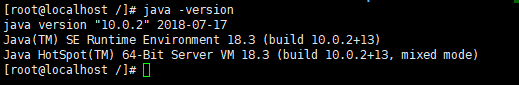
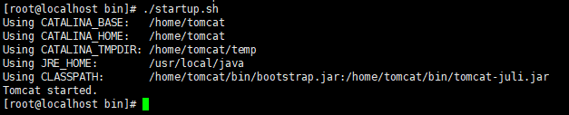
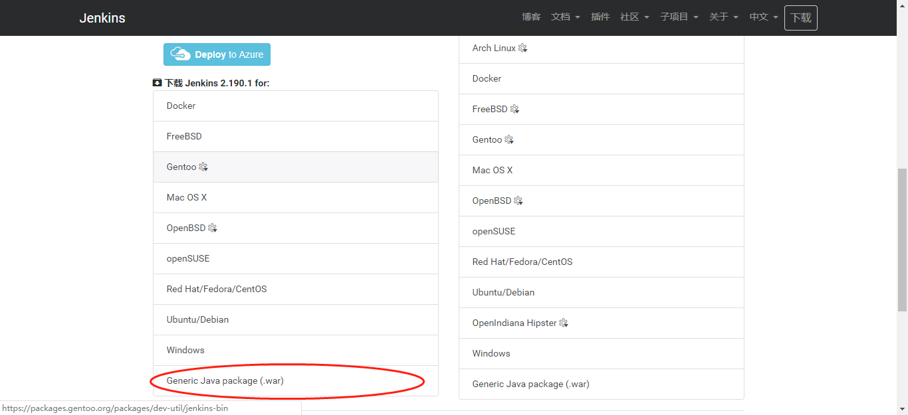
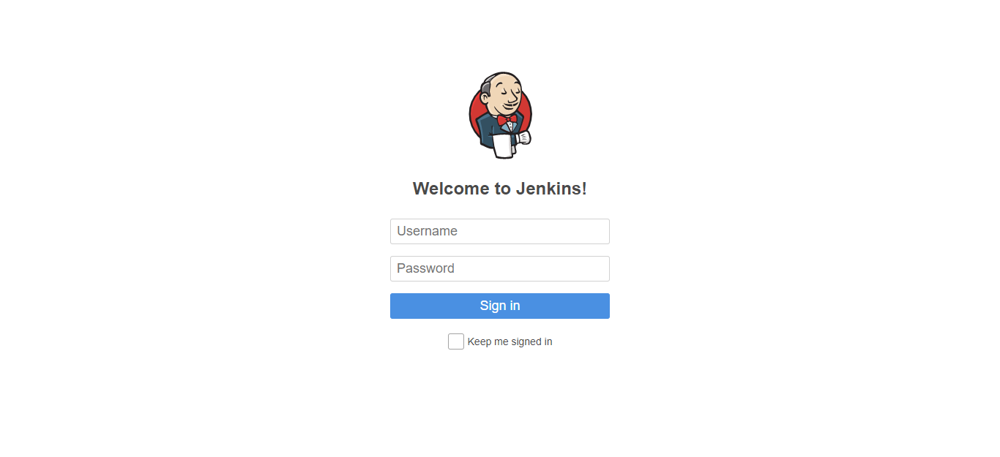

## Jenkins自动构建部署项目

#### 一、Jenkins在linux服务器上的安装
需要一台linux服务器或者自己安装虚拟机存在linux系统。

系统需要具备java环境以及tomcat容器：

下载jenkins的通用war包，放在tomcat的webapp目录下运行项目，访问http://ip:port/jenkins
即可访问jenkins应用服务。

通过配置服务器初始密码，以及jenkins初始安装的插件来启动jenkins服务：

