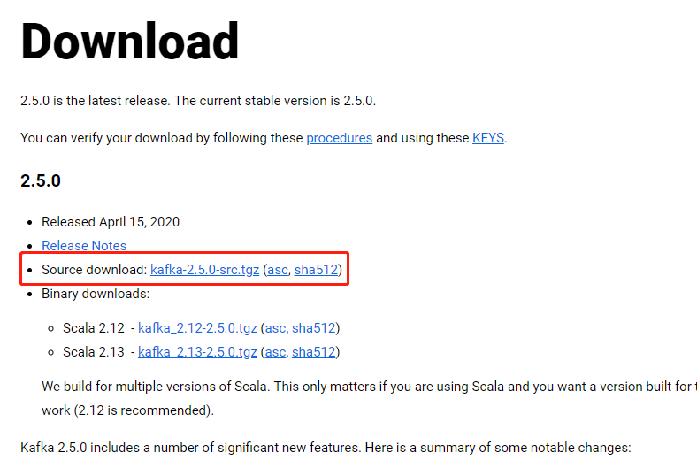

## 实时的分布式消息订阅系统Kafka入门指南

#### 1、kafka的安装过程
 
 * 1、1 下载
 
    在apache-kafka官方网站：http://kafka.apache.org/downloads，下载kafka的linux系统压缩包，这里选择
    kafka-2.5.0版本：
    
    
 * 1、2 安装
 
    将压缩包上传到linux服务器对应目录下，解压。   