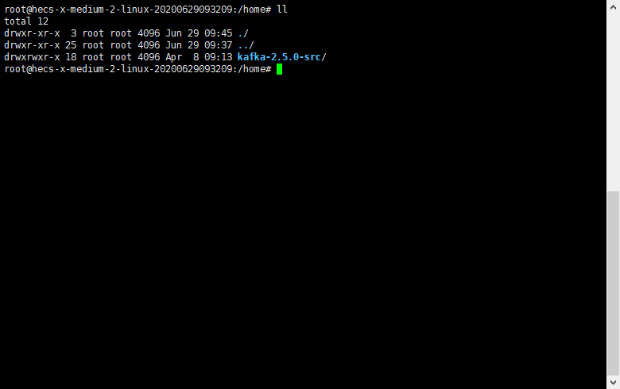
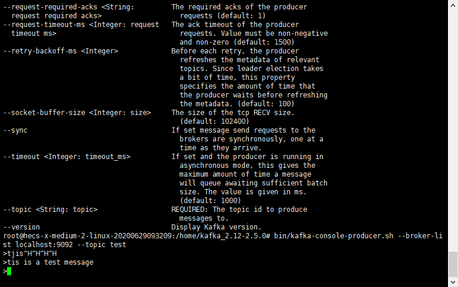

## 实时的分布式消息订阅系统Kafka入门指南

#### 1、kafka的安装过程
 
 * 1、1 下载
 
    在apache-kafka官方网站：http://kafka.apache.org/downloads，下载kafka的linux系统压缩包，这里选择
    kafka-2.5.0版本(备注：代src的kafka的源代码，需要下载它的二进制执行文件)：
    
    
 * 1、2 安装
 
    将压缩包上传到linux服务器对应目录下，解压。   
    
    
 * 1、3 配置
 
    本次使用的是kafka的最新版本，自带有zookeeper注册中心，因此沿用的都是软件的默认配置。
    
#### 2、Linux环境下kafka的使用

 * 2、1 启动zookeeper
 
    bin/zookeeper-server-start.sh config/zookeeper.properties
    
    
 * 2、2 启动kafka
 
    bin/kafka-server-start.sh config/server.properties
    
    
 * 2、3 创建一个topic test
    
    bin/kafka-topics.sh --create --zookeeper localhost:2181 --replication-factor 1 --partitions 1 --topic test
    
    
 * 2、4 创建一个consumer
 
    bin/kafka-console-consumer.sh --bootstrap-server localhost:9092 --topic test --from-beginning
    
    
 * 2、5 创建一个producer
 
    bin/kafka-console-producer.sh --broker-list localhost:9092 --topic test
    
    
 至此一个简单的kafka软件应用就在Linux服务器上搭建完成，只需要在producer里面输入你想要
 发送的消息文本按回车，在consumer终端就能看见你的消息message.                
 
          