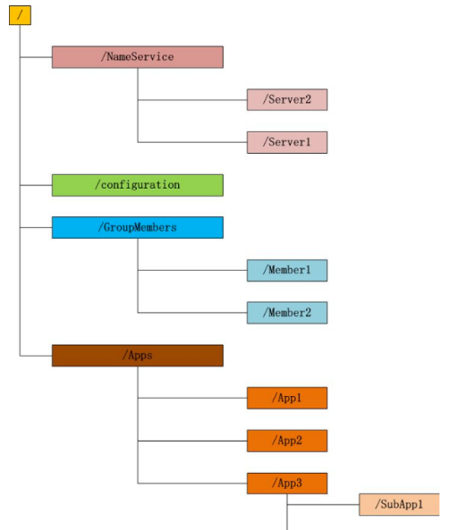

#### zookeeper分布式服务框架

主要是解决分布式应用中遇到的数据管理问题。

1. 统一命名服务

2. 状态管理服务

3. 集群管理

4. 分布式配置项的应用管理

主要的核心内容包括两个方面：文件系统+监听通知机制

#### Zookeeper能做什么
zookeeper功能非常强大，可以实现诸如分布式应用配置管理、统一命名服务、状态同步服务、
集群管理等功能，我们这里拿比较简单的分布式应用配置管理为例来说明。

假设我们的程序是分布式部署在多台机器上，如果我们要改变程序的配置文件，需要逐台机器去修改，
非常麻烦，现在把这些配置全部放到zookeeper上去，保存在 zookeeper 的某个目录节点中，然后
所有相关应用程序对这个目录节点进行监听，一旦配置信息发生变化，每个应用程序就会收到 zookeeper 
的通知，然后从 zookeeper 获取新的配置信息应用到系统中。

